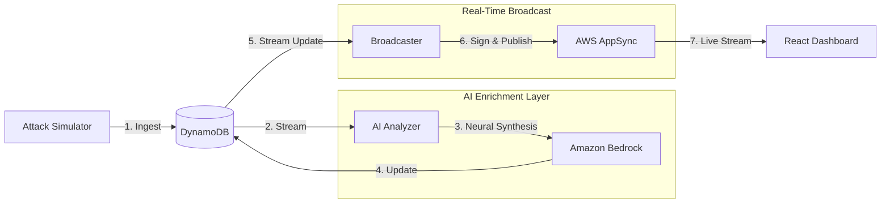

# 🛡️ CLOUD-SENTRY // Autonomous AI Threat Intelligence

**CLOUD-SENTRY** is a high-performance, real-time security monitoring dashboard designed to intercept and visualize live cloud attack vectors. By leveraging a serverless event-driven architecture, it transforms raw logs into an immersive, cyberpunk-inspired intelligence feed with sub-second latency.

---

## ⚡ The Core Innovation

Most security dashboards rely on **Polling** (manually requesting updates). **CLOUD-SENTRY** implements a **Push-Architecture**:

* **Zero-Polling:** Sub-second data propagation via **GraphQL Subscriptions** (WebSockets).
* **AI-in-the-Loop:** Every threat is analyzed by **Amazon Bedrock (Claude 3)** before hitting the UI.
* **Cyberpunk UX:** A high-fidelity React interface designed for low-latency SOC environments.

---

## 🏗️ System Architecture & Logic

This project utilizes a modern **Event-Driven Architecture (EDA)**. The goal was to create a "Live-Wire" system where the backend pushes data to the UI the millisecond it is processed.

### 📊 Intelligence Pipeline

### 🧠 Architectural Breakdown

* **Ingestion (DynamoDB):** Attack data is ingested into a NoSQL table. I chose DynamoDB for its predictable sub-10ms performance and its native ability to trigger downstream events.
* **Neural Analysis (AWS Lambda & Amazon Bedrock):** * Triggers automatically on DynamoDB `INSERT` events.
    * Leverages **Claude 3 Haiku** to interpret raw attack signatures (SQLi, Brute Force, etc.).
    * Returns structured JSON containing a technical **Summary** and **Actionable Countermeasure**.
* **The "Broadcaster" (AWS Lambda):** * Acts as a security-hardened client using **AWS SigV4 signing**.
    * Maps DynamoDB `NewImage` data types to GraphQL variables.
    * Hydrates the UI with the final analyzed payload.
* **Real-Time Broadcast (AWS AppSync):** * Manages **WebSocket** connections for all connected clients.
    * Broadcasts threat data instantly to the dashboard the moment the Broadcaster publishes an update.

---

## 🛠️ Tech Stack

* **Frontend:** React 18, Tailwind CSS, Apollo Client (GraphQL)
* **Compute:** AWS Lambda (Python 3.12)
* **Intelligence:** Amazon Bedrock (Anthropic Claude 3 Haiku)
* **Database:** Amazon DynamoDB (NoSQL + Streams)
* **API/Real-time:** AWS AppSync (GraphQL Subscriptions)
* **Security:** AWS IAM with SigV4 Authentication

---

## 🚀 Deployment Highlights

* **Modular React Design:** Decoupled components with memoized AI-JSON parsing for peak performance.
* **Cyberpunk Aesthetics:** Custom Tailwind animations, scanline overlays, and neon-themed state management.
* **Fault Tolerance:** Structured logging via AWS CloudWatch and robust error handling for AI API timeouts.
