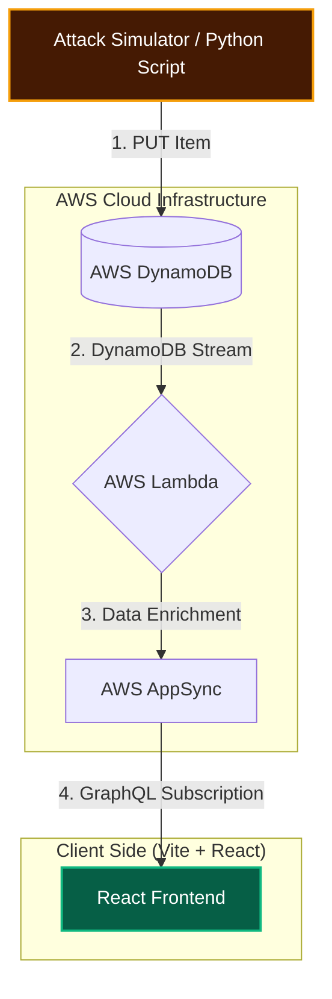

# 🛡️ CLOUD-SENTRY // Autonomous Threat Intelligence

**CLOUD-SENTRY** is a high-performance, real-time security monitoring dashboard designed to intercept and visualize live cloud attack vectors. By leveraging a serverless event-driven architecture, it transforms raw logs into an immersive, cyberpunk-inspired intelligence feed with sub-second latency.

---

## 🏗️ System Architecture & Logic

This project utilizes a modern **Event-Driven Architecture (EDA)**. The goal was to create a "Zero-Polling" system where the frontend never asks for data; instead, the backend pushes data to the UI the millisecond it is generated.

### 📊 Data Flow Visualization

### 🧠 Architectural Breakdown

* **Ingestion (DynamoDB):** Attack data is ingested into a NoSQL table. I chose DynamoDB for its predictable sub-10ms performance and its native ability to trigger downstream events.
* **The "Trigger" (DynamoDB Streams):** By enabling Streams, every `INSERT` action is captured as a time-ordered sequence of item-level changes. This is the heartbeat of the project, allowing for asynchronous processing without blocking the main data ingestion flow.
* **Orchestration & Enrichment (AWS Lambda):** A serverless function "listens" to the stream in real-time.
    * It parses the raw attack signature from the stream record.
    * It performs business logic, such as calculating threat severity levels.
    * It acts as a **SigV4-signed client** to securely push the enriched data to the AppSync GraphQL endpoint.
* **Real-Time Broadcast (AWS AppSync):** Instead of traditional REST APIs or manual polling, I implemented **GraphQL Subscriptions**. AppSync manages the WebSocket connections for all connected clients, broadcasting the threat data instantly to the dashboard the moment the Lambda function publishes an update.
